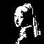
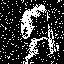

# Rete neurale di Hopfield

- [Descrizione del problema](#descrizione-del-problema)
- [1. Acquisizione dei pattern](#1-acquisizione-dei-pattern)
- [2. Fase di apprendimento](#2-fase-di-apprendimento)
- [3. Fase di richiamo](#3-fase-di-richiamo)
- [Esempio semplificato](#esempio-semplificato)
- [Limitazioni del modello](#limitazioni-del-modello)
- [Possibili estensioni del modello](#possibili-estensioni-del-modello)
- [Riferimenti utili](#riferimenti-utili)

---

## Descrizione del problema

Una **rete neurale di Hopfield** è un tipo di rete neurale ricorrente introdotta da John J. Hopfield nel 1982. Funziona come una **memoria associativa**: la rete impara a riconoscere certi schemi (detti *pattern*) e, quando le viene mostrato uno schema parziale o rumoroso, riesce a ricostruire quello originale completo.

Immagina di cercare di ricordare una canzone sentendo solo poche note: il cervello ricostruisce automaticamente il resto. Le reti di Hopfield funzionano in modo analogo.

Dal punto di vista fisico, il sistema è composto da $N$ neuroni, ciascuno dei quali può trovarsi in uno di due stati: acceso ($+1$) o spento ($-1$). I neuroni sono tutti collegati tra loro con connessioni simmetriche (se $A$ è connesso a $B$, allora $B$ è connesso ad $A$ con la stessa intensità). La rete evolve nel tempo seguendo una **regola di aggiornamento** che porta il sistema a minimizzare una funzione di energia, in modo del tutto analogo a un sistema fisico che si assesta nel suo stato di minima energia.

Il riferimento originale: [Hopfield, "Neural networks and physical systems with emergent collective computational abilities" (1982)](https://www.pnas.org/doi/10.1073/pnas.79.8.2554)

Il progetto si articola in tre fasi principali:

1. **Acquisizione dei pattern** — leggere le immagini e convertirle in vettori binari di ±1.
2. **Apprendimento** — calcolare la matrice dei pesi $W$ che codifica i pattern nella memoria della rete.
3. **Richiamo** — partire da un pattern corrotto o incompleto e lasciare evolvere la rete fino alla convergenza.

---

## 1. Acquisizione dei pattern

Prima di poter addestrare la rete, bisogna preparare i dati. Ogni immagine di input viene convertita in un vettore di valori ±1, che è il formato che la rete sa elaborare.

### Caricamento dell'immagine

Le immagini vengono caricate pixel per pixel, ad esempio tramite la libreria grafica SFML. Ogni pixel è descritto da tre valori: le componenti di colore rosso ($R$), verde ($G$) e blu ($B$), ciascuna compresa tra 0 e 255.

### Uniformazione delle dimensioni

La rete richiede che tutti i pattern abbiano la stessa lunghezza $N$ (numero totale di pixel). Se le immagini di partenza hanno dimensioni diverse, è necessario ridimensionarle prima della conversione. Due strategie possibili:

- **Metodo semplice**: rimuovere regolarmente righe e colonne, ad esempio eliminare ogni $k$-esima riga e colonna finché non si raggiunge la dimensione desiderata.
- **Metodo più accurato (interpolazione bilineare)**: il valore di ogni pixel nella nuova immagine viene calcolato come media pesata dei pixel vicini nell'immagine originale. Produce risultati visivamente migliori, ma è più complesso da implementare.

### Binarizzazione

Per ogni pixel, si calcola la media delle tre componenti di colore:

```math
\text{grigio} = \frac{R + G + B}{3}
```

Se il valore supera una soglia (tipicamente 127), il pixel diventa $+1$ (chiaro); altrimenti diventa $-1$ (scuro). L'immagine viene poi "srotolata" in un vettore monodimensionale leggendo i pixel riga per riga, ottenendo il pattern $\xi^\mu$.

L'indice $\mu$ identifica il pattern (da 1 al numero totale $P$ di immagini), l'indice $i$ identifica il neurone (da 1 a $N$). Il valore del neurone $i$ nel pattern $\mu$ si indica con $\xi_i^\mu$.

### Visualizzazione

È utile visualizzare sia l'immagine originale che quella binarizzata per verificare che la conversione sia corretta.

<div style="text-align: center;">
  
  
</div>

---

## 2. Fase di apprendimento

L'obiettivo di questa fase è costruire la matrice dei pesi $W$, che rappresenta la "memoria" della rete. Ogni elemento $W_{ij}$ descrive quanto è forte la connessione tra il neurone $i$ e il neurone $j$.

### La regola di Hebb

La regola usata per costruire $W$ si chiama **regola di Hebb**, ispirata all'idea biologica che "neuroni che si attivano insieme si connettono insieme". In pratica, se due neuroni tendono ad avere lo stesso valore in molti pattern memorizzati, la loro connessione sarà forte e positiva; se tendono ad avere valori opposti, sarà forte e negativa.

La formula esplicita è:

```math
W_{ij} =
\begin{cases}
\dfrac{1}{N} \displaystyle\sum_{\mu=1}^{P} \xi_i^\mu\, \xi_j^\mu & \text{se } i \neq j \\[10pt]
0 & \text{se } i = j
\end{cases}
```

La diagonale è posta a zero per evitare che un neurone si influenzi da solo. La divisione per $N$ è una normalizzazione che mantiene i pesi in un intervallo ragionevole indipendentemente dalla dimensione del pattern.

### Proprietà della matrice

La matrice $W$ è **simmetrica**: $W_{ij} = W_{ji}$ per ogni coppia di neuroni. Questo è fondamentale perché garantisce che la funzione di energia (introdotta nella fase di richiamo) non possa mai aumentare durante l'evoluzione della rete.

### Salvataggio

Dopo il calcolo, la matrice $W$ viene salvata su file. Questo evita di ripetere la fase di apprendimento ogni volta: basterà caricare la matrice già calcolata per avviare il richiamo.

---

## 3. Fase di richiamo

La rete è ora addestrata. In questa fase, le viene presentato un pattern corrotto o incompleto, e lasciamo che evolva spontaneamente verso uno dei pattern memorizzati.

### Preparazione del pattern corrotto

Si parte da uno dei pattern memorizzati e lo si corrompe in uno di questi modi:

- **Rumore casuale**: si invertono casualmente alcuni pixel (si cambiano alcuni $+1$ in $-1$ e viceversa), simulando un'immagine distorta.
- **Taglio**: si inverte sistematicamente una porzione dell'immagine (ad esempio la metà inferiore), simulando un'immagine parziale.

<div style="text-align: center;">
  
</div>

### Dinamica di aggiornamento

La rete aggiorna lo stato dei neuroni uno alla volta (aggiornamento asincrono) seguendo questa regola:

```math
s_i(t+1) = \text{sign}\!\left(\sum_{j=1}^{N} W_{ij}\, s_j(t)\right)
```

dove $s_i(t)$ è lo stato del neurone $i$ al tempo $t$. In parole semplici: ogni neurone guarda la "somma pesata" degli stati di tutti gli altri neuroni. Se questa somma è positiva, il neurone si porta a $+1$; se è negativa, si porta a $-1$.

Questo processo viene ripetuto iterativamente fino alla convergenza.

### Criterio di convergenza

La rete ha raggiunto uno stato stabile quando un'intera iterazione non produce alcun cambiamento:

```math
s_i(t+1) = s_i(t) \quad \forall\, i
```

A quel punto la rete si è assestata in un minimo della funzione di energia, che corrisponde idealmente a uno dei pattern memorizzati.

### Funzione di energia

Per monitorare il processo, si introduce la **funzione di energia**:

```math
E(t) = -\frac{1}{2} \sum_{i,j} W_{ij}\, s_i(t)\, s_j(t)
```

Questa grandezza non è un'energia fisica nel senso termodinamico, ma è un'analogia matematica molto utile: si può dimostrare che, grazie alla simmetria di $W$, la funzione $E$ **non può mai aumentare** durante l'evoluzione della rete con aggiornamento asincrono. Ogni aggiornamento porta il sistema verso un minimo locale, e il processo termina quando un minimo è raggiunto.

Monitorare $E(t)$ ad ogni iterazione permette di verificare che la convergenza stia avvenendo correttamente: il grafico deve essere sempre decrescente o costante.

---

## Esempio semplificato

Consideriamo una rete con soli 4 neuroni ($N = 4$) e due pattern memorizzati ($P = 2$):

```math
\xi^{(1)} = (-1,\; 1,\; 1,\; -1)
\qquad
\xi^{(2)} = (1,\; -1,\; -1,\; 1)
```

Nota che $\xi^{(2)} = -\xi^{(1)}$: i due pattern sono opposti.

### Passo 1: calcolo della matrice dei pesi

Si applica la regola di Hebb. La matrice è $4 \times 4$ con diagonale nulla. Per ogni coppia $(i,j)$ con $i \neq j$:

```math
W_{ij} = \frac{1}{4}\left(\xi_i^{(1)}\xi_j^{(1)} + \xi_i^{(2)}\xi_j^{(2)}\right)
```

| Coppia | Contributo pattern 1 | Contributo pattern 2 | $W_{ij}$ |
|--------|----------------------|----------------------|----------|
| $W_{12}$ | $(-1)(1) = -1$ | $(1)(-1) = -1$ | $-1/2$ |
| $W_{13}$ | $(-1)(1) = -1$ | $(1)(-1) = -1$ | $-1/2$ |
| $W_{14}$ | $(-1)(-1) = 1$ | $(1)(1) = 1$   | $+1/2$ |
| $W_{23}$ | $(1)(1) = 1$   | $(-1)(-1) = 1$ | $+1/2$ |
| $W_{24}$ | $(1)(-1) = -1$ | $(-1)(1) = -1$ | $-1/2$ |
| $W_{34}$ | $(1)(-1) = -1$ | $(-1)(1) = -1$ | $-1/2$ |

Gli elementi non elencati si ricavano per simmetria ($W_{ji} = W_{ij}$).

### Passo 2: richiamo da pattern corrotto

Supponiamo di presentare alla rete questo pattern corrotto (il primo bit è sbagliato rispetto a $\xi^{(1)}$):

```math
s_{\text{iniziale}} = (1,\; -1,\; 1,\; -1)
```

Si aggiornano i neuroni uno alla volta:

**Neurone 1:**
```math
h_1 = W_{12}s_2 + W_{13}s_3 + W_{14}s_4
    = (-\tfrac{1}{2})(-1) + (-\tfrac{1}{2})(1) + (\tfrac{1}{2})(-1)
    = \tfrac{1}{2} - \tfrac{1}{2} - \tfrac{1}{2} = -\tfrac{1}{2}
```
$s_1' = \text{sign}(-\tfrac{1}{2}) = -1$ ✓

**Neurone 2:**
```math
h_2 = W_{21}s_1' + W_{23}s_3 + W_{24}s_4
    = (-\tfrac{1}{2})(-1) + (\tfrac{1}{2})(1) + (-\tfrac{1}{2})(-1)
    = \tfrac{3}{2}
```
$s_2' = \text{sign}(\tfrac{3}{2}) = +1$ ✓

**Neurone 3** e **Neurone 4** si aggiornano in modo analogo e restano rispettivamente $+1$ e $-1$.

Il pattern finale è:

```math
s' = (-1,\; 1,\; 1,\; -1) = \xi^{(1)}
```

La rete ha corretto il bit errato e recuperato il pattern memorizzato.

---

## Limitazioni del modello

- **Capacità limitata**: il numero massimo di pattern che la rete riesce a memorizzare senza errori è circa $0.138 \times N$. Per una rete con 1000 neuroni, si possono memorizzare al massimo circa 138 pattern in modo affidabile.

- **Pattern spuri**: possono comparire stati stabili che non corrispondono ad alcun pattern memorizzato. Questi sono detti *attrattori spuri* e rappresentano il principale difetto del modello. Le principali tipologie sono le *miscele*, stati stabili che corrispondono alla media di un numero dispari di pattern, e gli stati *spin-glass*, configurazioni caotiche senza relazione con i pattern.

- **Pattern troppo simili**: se due pattern memorizzati si assomigliano molto, la rete può confonderli durante il richiamo.

- **Solo valori binari**: il modello standard lavora esclusivamente con stati $\pm 1$.

---

## Possibili estensioni del modello

### Sfavorimento dei pattern spuri (campo non lineare)

Il campo di aggiornamento della regola standard può essere riscritto senza usare la matrice $W$, calcolando direttamente gli **overlap** tra lo stato attuale e ciascun pattern memorizzato:

```math
m^\mu(t) = \frac{1}{N} \sum_{j=1}^{N} \xi_j^\mu\, s_j(t)
```

L'overlap $m^\mu$ misura quanto lo stato corrente $s(t)$ assomiglia al pattern $\xi^\mu$: vale $+1$ se coincidono perfettamente, $-1$ se sono opposti, $0$ se sono ortogonali. Con questa notazione, la regola di aggiornamento standard diventa equivalente a:

```math
s_i(t+1) = \text{sign}\!\left(\sum_{\mu=1}^{P} m^\mu(t)\; \xi_i^\mu\right)
```

Il problema è che i pattern spuri (stati misti con due overlap simili, $m^1 \approx m^2$) sono punti fissi stabili di questa equazione. La soluzione più semplice è **sostituire** $m^\mu$ con una funzione superlineare $f(m^\mu)$:

```math
s_i(t+1) = \text{sign}\!\left(\sum_{\mu=1}^{P} f(m^\mu)\; \xi_i^\mu\right)
```

La scelta più elementare è $f(m) = m^3$. Intuitivamente: se $m^1 = 0.6$ e $m^2 = 0.6$ (stato misto), dopo la cubing si ha $f(m^1) = f(m^2) = 0.216$ e lo stato rimane instabile, mentre qualsiasi piccola perturbazione che avvicina la rete a uno dei due pattern viene amplificata, portando alla convergenza verso il pattern puro. Per un pattern puro, invece ($m^1 \approx 1$, tutti gli altri $\approx 0$), la non linearità non cambia il risultato: $f(1) = 1$.

Questo approccio porta due vantaggi pratici: elimina la necessità di allocare e memorizzare la matrice $W$ (che occupa $O(N^2)$ memoria), riducendo l'aggiornamento da $O(N^2)$ a $O(NP)$ operazioni per iterazione; e sopprime gli attrattori spuri senza modificare quelli corrispondenti ai pattern memorizzati.

Usando invece $f(m) = \exp(\beta\, m)$ con $\beta$ grande si ottiene la formulazione delle *Modern Hopfield Networks* (Ramsauer et al., 2020), che raggiunge una capacità di memoria esponenziale in $N$.

### Algoritmo di Metropolis-Hastings

Invece di aggiornare ogni neurone in modo deterministico, si introduce una **dinamica stocastica**: il neurone $i$ cambia stato con una probabilità che dipende dalla variazione di energia $\Delta E$ che il flip produrrebbe:

```math
P(\text{flip}) = \frac{1}{1 + e^{\,\Delta E / T}}
```

dove $T$ è un parametro che gioca il ruolo di temperatura. Se $\Delta E < 0$ (il flip abbassa l'energia), il cambio viene quasi sempre accettato. Se $\Delta E > 0$ (il flip aumenta l'energia), viene accettato solo con una piccola probabilità. Questo meccanismo permette alla rete di **uscire da minimi locali spuri**, a costo di rallentare la convergenza.

### Simulated Annealing

Si estende l'approccio di Metropolis introducendo una temperatura $T$ che **decresce gradualmente** nel tempo, seguendo uno schema detto *schedule di raffreddamento*. Inizialmente, con $T$ alta, la rete esplora liberamente lo spazio degli stati; man mano che $T$ scende, il sistema si assesta progressivamente verso stati di energia sempre più bassa. L'analogia fisica è la ricottura dei metalli: riscaldando e poi raffreddando lentamente un materiale, gli atomi trovano la configurazione cristallina di minima energia.

---

## Riferimenti utili

- [Hopfield, "Neural networks and physical systems with emergent collective computational abilities" (1982)](https://www.pnas.org/doi/10.1073/pnas.79.8.2554) — l'articolo originale.
- [Hopfield Networks is All You Need](https://ml-jku.github.io/hopfield-layers/) — panoramica moderna sulle reti di Hopfield, con estensioni deep learning e connessioni con le Modern Hopfield Networks.
- [Wikipedia — Metropolis-Hastings algorithm](https://en.wikipedia.org/wiki/Metropolis%E2%80%93Hastings_algorithm)
- [Wikipedia — Simulated Annealing](https://en.wikipedia.org/wiki/Simulated_annealing)
